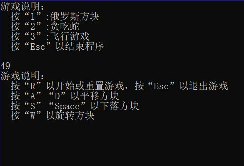
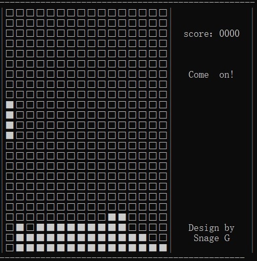
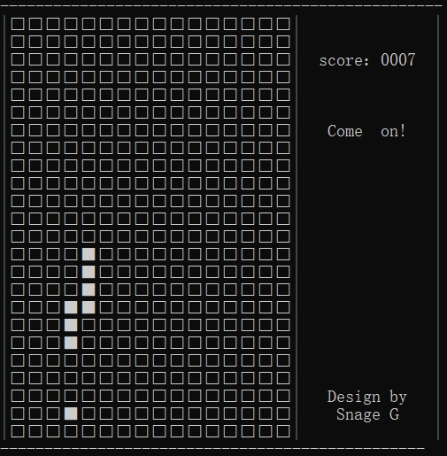
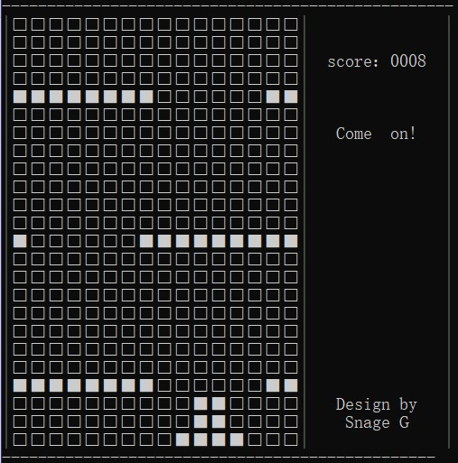

# 碎言碎语
自己搞出来的小程序，一个包含俄罗斯方块、贪吃蛇、飞行游戏的迷你游戏机。  
这个项目使用`C++`语言，是为硬件课设的FPGA板件上的最小处理器写的嵌软部分代码，可以修改Print.cpp以适配不同的显示需求（硬件课设时，要求对LED点阵逐行点亮）。  
程序运行时没有定时下降一格或者前进一步的功能，所以使用空格来模拟定时器。本来是要将FPGA的定时器作为中断来推进游戏，写嵌软部分时用空格代替了。  
.exe文件可以直接运行。

---
# 眼见为实

